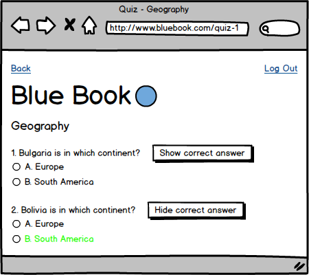
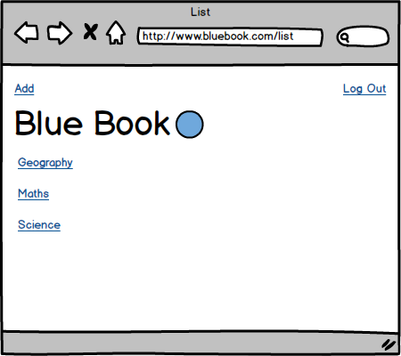
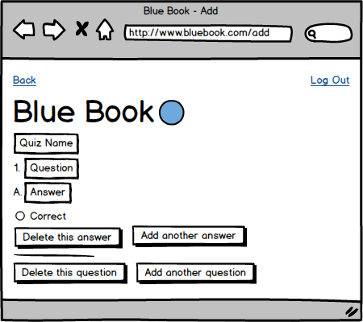

# Design Documentation

## Assumptions

Page 6, first bullet in the **Viewing and Editing** section: _"A user with Restricted permission can select a quiz from available quizzes. Having selected the quiz, all questions in that quiz can be viewed on the screen."_

This does not state that the answers to each question will also be viewed on the screen, however also on page 6, second bullet in the **Quizzes** section: _"Each answer is a text string, **shown in the user interface** indexed by an uppercase character."_

So, I am assuming the answers to each question will also be viewed on the screen.

Page 7, second bullet in the **Viewing and Editing** section: _"A user with View permission can select and view a quiz as above. They can also select a question to see the associated answers."_

As I have already assumed the answers to each question will be viewed on the screen by a user with Restricted permissions, I am assuming the these sentences to mean: _"A user with View permission can select and view a quiz as above. They can also select a question to see **[its]** associated **[correct]** answer."_

## User Stories

```
As a user,
So that I can access the application,
I would like to log in.

As a user,
So that others cannot access the application as me,
I would like to log out.

As a user,
So that I can select a specific quiz,
I would like to see a list of quizzes.

As a user,
So that I can take the quiz,
I would like to see its questions and multiple-choice answers.

As a user with view access,
So that I can check question and answer accuracy,
I would like to be able to see correct answers.

As a user with edit access,
So that I can add quizzes to be attempted,
I would like to be able to add a quiz (name, question(s) and answers).

As a user with edit access,
So that I can correct mistakes,
I would like to be able to edit quizzes (name, question(s) and answers).

As a user with edit access,
So that I can remove mistakes,
I would like to be able to delete a quiz, a question(s), or an answer(s).

As a user with edit access,
So that I can expand a quiz,
I would like to be able to add a question(s), or an answer(s).
```

## Data Model

The below was drawn using [SqlDBM](https://app.sqldbm.com/):


The Primary Key from the `permissions` table acts as a Foreign Key in the `people` table.  
The Primary Key from the `quizes` table acts as a Foreign Key in the `questions` table.  
The Primary Key from the `questions` tabale acts as a Foreign Key in the `answers` table.  

## User Interface

### _The Log In Page_


The first page a user will reach, and the only page a unlogged in user can reach.

The brand name and logo will be visible at the top of the page.

The `username` input will be set as a required text input, the user being expected to enter the pre-defined username.

The `password` input will be set as a required password input (masked characters), the user being expected to enter the pre-defined password.

The `Submit` button will validate that both required fields have something in them.

The `Username or password incorrect` message will only be visible after an unsuccessful log in attempt.

### _The List Page_


The first page a user will reach after successfully logging in.

The `Log Out` link will be on the top right of the page and will return the user to the log in page and clear session data.

Each link below the brand name and logo will link to a quiz.

### _The Quiz Page_


The `Back` link will be on the top left of the page and will return the user to the list page.

The brand name and logo will be visible near the top of the page.

The quiz name will be below the brand namd and logo.

The questions with be below the quiz name.

The answers will be below each question.

### _View Permission_



When logged in as a user with View permission, there will be a `Show/hide correct answer` button beside each question.

Each button will toggle a style to indicate the correct answer for that question, and the text on the `Show/hide correct answer` button.

### _Edit Permission_



When logged in as a user with Edit permission, there be an `Add` link above the brand name and logo linking to the add page.

### _The Add Page_



The `Quiz Name` input will be set as a required text input, the user being expected to enter the name for their quiz.

The `Question` input will be set as a required text input, the user being expected to enter at least one question.

The `Answer` input will be set as a required text input, the user being expected to enter at least one answer.

The `Correct` input will be set as a required radio input, the user being expected to select at least one answer as being correct.

The `Delete this answer` button will delete the answer above it, and reindex all answers for that question.

The `Add another answer` button will add another `Answer` input for that question and a corresponding `Correct` input.

The `Delete this question` button will delete the question above it, inluding all answers, and reindex all questions for the quiz.
