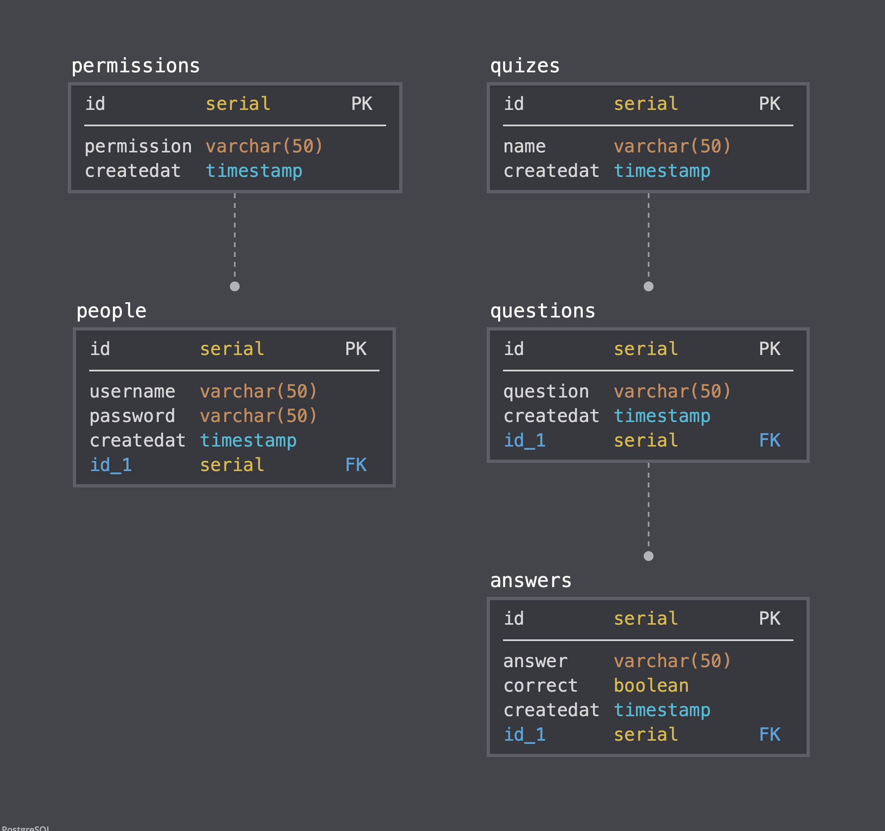
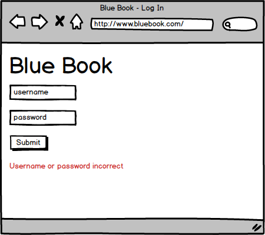
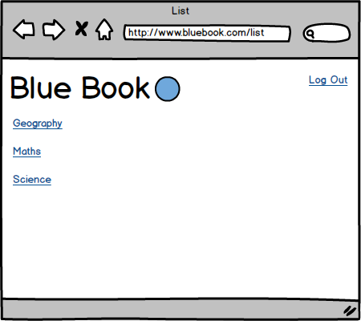
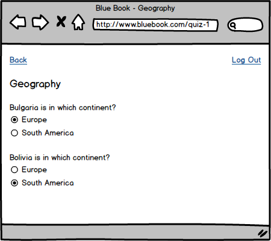

# BCS Digital Industries Apprenticeship

## Software Developer Synoptic Project - Quiz Manager

### Design Documentation

#### Assumptions:

- Once logged in, there will be quizzes a user can select.
- Users with view access are able to see answers so that they can score quiz attempts.

#### User Stories:

```
As a user,
So that I can access the application,
I would like to log in.

As a user,
So that others cannot access the application as me,
I would like to log out.

As a user,
So that I can select a specific quiz,
I would like to see a list of quizzes.

As a user,
So that I can take the quiz,
I would like to see its questions and multiple-choice answers.

As a user with view access,
So that I can score quiz attempts,
I would like to be able to see correct answers.

As a user with edit access,
So that I can add quizzes to be attempted,
I would like to be able to add a quiz (name, question(s) and answers).

As a user with edit access,
So that I can correct mistakes,
I would like to be able to edit quizzes (name, question(s) and answers).

As a user with edit access,
So that I can remove mistakes,
I would like to be able to delete a quiz, a question(s), or an answer(s).

As a user with edit access,
So that I can expand a quiz,
I would like to be able to add a question(s), or an answer(s).
```

#### Data Model:

The below was drawn using [SqlDBM](https://app.sqldbm.com/):



The Primary Key from the `permissions` table acts as a Foreign Key in the `people` table.  
The Primary Key from the `quizes` table acts as a Foreign Key in the `questions` table.  
The Primary Key from the `questions` tabale acts as a Foreign Key in the `answers` table.  

### User Interface:

The log in page:



The first page a user will reach, and the only page a unlogged in user can reach.

The `username` input will be set as a required text input, the user being expected to enter the pre-defined username.

The `password` input will be set as a required password input (masked characters), the user being expected to enter the pre-defined password.

The `Submit` button will validate that both required fields have something in them.

The `Username or password incorrect` message will only be visible after an unsuccessful log in attempt.

The list page:



The first page a user will reach after successfully logging in.

The `log out` link will return the user to the log in page and clear session data.

Each link below the title will link to a quiz.

The quiz page:



The `back` link will return the user to the list page.

The `log out` link will return the user to the log in page and clear session data.

The quiz name will be near the top of the page.

The questions with be below the quiz name.

The answers will be below each question.